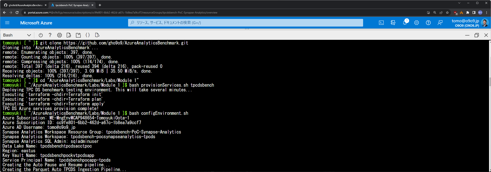
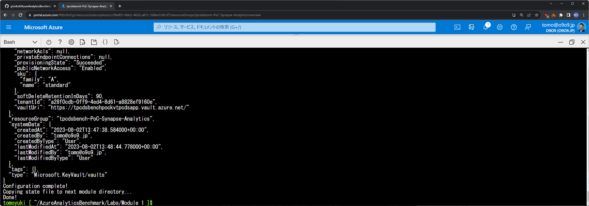
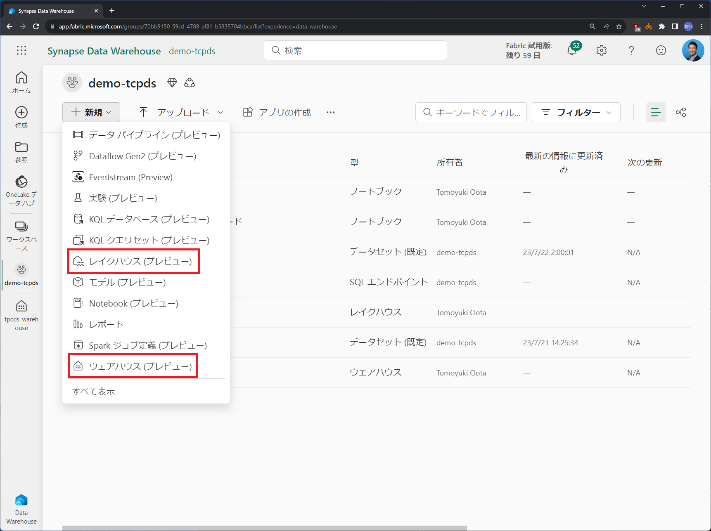
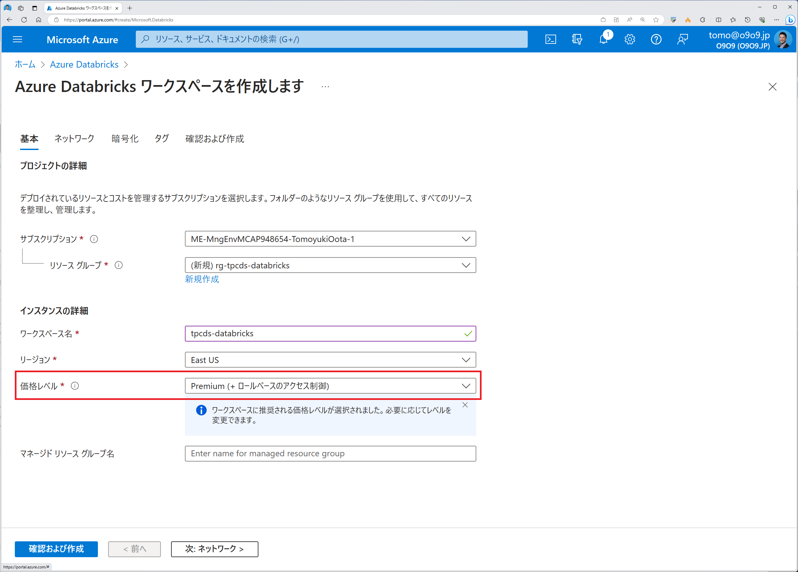
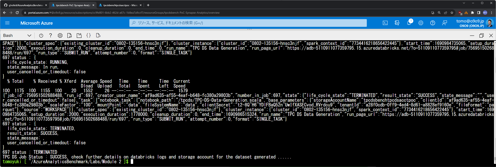
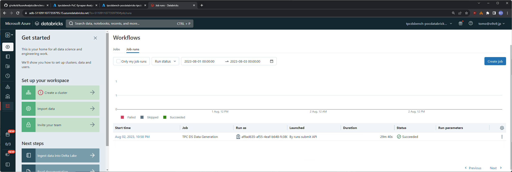
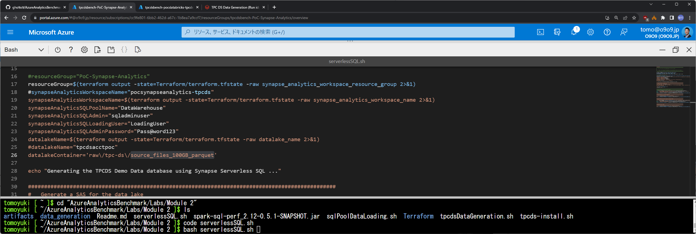
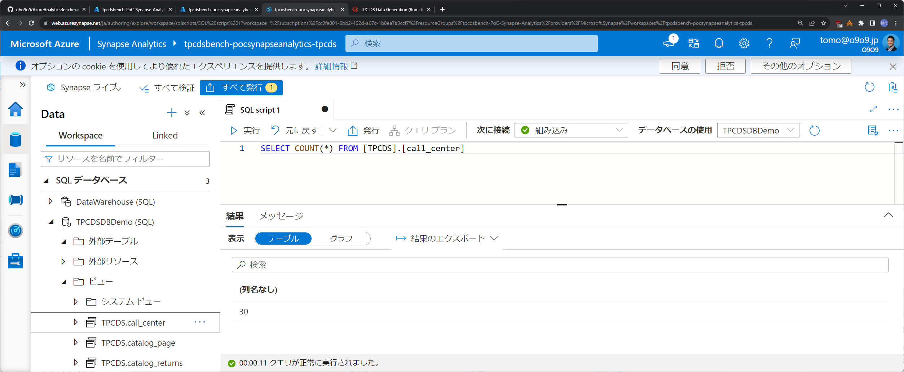

# 1. はじめに

本ドキュメントは簡易 TPC-DS ベンチマークのためのリソース一式を提供します。
- データ
- スキーマ定義
- クエリ
- ベンチマークスクリプト
- 環境構築～ベンチマークまでの手順

### TPC-DSとは
[TPC（トランザクション処理性能評議会）](https://www.tpc.org/information/who/whoweare5.asp)が定める各種ベンチマークテストの一部で **データウェアハウス向けのベンチマーク**（[Specはココ](https://www.tpc.org/tpc_documents_current_versions/current_specifications5.asp)） に利用されるテスト定義です。これには極めてシンプルな集計から複雑なパターンマイニングまで、さまざまな複雑さを持つ 99 のクエリが含まれています。TPC-DS は複雑さが増す分析を反映した 2000 年代半ばからスタートした比較的新たな取り組みのベンチマークになっており、この 20 年間でデータウェアハウスのベンチマークの事実上の標準といえます。


# 2. Setup

## 2-1. リソースデプロイ

ベンチマーク対象とする各リソースをデプロイします。

### Synapse Serverless SQL と Synapse Dedicated SQL  
以下のコマンドを実行します。ここではデータ生成用の Storage と Databricks（Standard SKU） もデプロイしています。
```bash
az account set --subscription "YourSubscriptionName"
git clone https://github.com/gho9o9/AzureAnalyticsBenchmark.git
cd "AzureAnalyticsBenchmark/Labs/Module 1"
bash provisionServices.sh <serviceNamePrefix>
```

[configEnvironment.sh:L120](https://github.com/gho9o9/Azure-Synapse-TPC-DS-Benchmark-Testing/blob/bd6e976f41b245df7bee32a6acce2509488c5bcd/Labs/Module%202/serverlessSQL.sh#L26) の datalakeContainer 変数で示されるデータソースへのパスを環境に応じて適宜修正したのちスクリプトを実行します。
```bash
code configEnvironment.sh
bash configEnvironment.sh
```

  
  
  

### Fabric Warehouse と Fabric Lakehouse
Fabric GUI からそれぞれのリソースをデプロイします。


### Databricks SQL
Azure Portal から Databricks（Premium SKU）をデプロイします。Databricks SQL には Premium SKU が必要です。

  
## 2-2. データ生成

<!-- 
### スケール設定
[tpcdsDataGeneration.sh:L76](https://github.com/gho9o9/Azure-Synapse-TPC-DS-Benchmark-Testing/blob/f837ddfdf84b3cd66c673a7092488262f81c4fb0/Labs/Module%202/tpcdsDataGeneration.sh#L76) の scaleFactor（GB単位）で設定
-->

生成するデータ量（GB単位）をパラメータで指定し tpcdsDataGeneration.sh を実行します。

```bash
cd "AzureAnalyticsBenchmark/Labs/Module 2"
# データ量 10 GB を指定
bash tpcdsDataGeneration.sh 10
```

  
  

参考：スケールに応じたデータ件数とサイズ


## 2-3. スキーマ定義とデータロード

### Synapse Serverless SQL
[serverlessSQL.sh:L26](https://github.com/gho9o9/Azure-Synapse-TPC-DS-Benchmark-Testing/blob/bd6e976f41b245df7bee32a6acce2509488c5bcd/Labs/Module%202/serverlessSQL.sh#L26) の datalakeContainer 変数で示されるデータソースへのパスを環境に応じて適宜修正したのちスクリプトを実行します。該当スクリプトは冪等で実装されているため、テストデータを格納するストレージロケーションやデータサイズの変更時などで繰り返し実行可能です。  

```bash
cd "AzureAnalyticsBenchmark/Labs/Module 3"
code serverlessSQL.sh
```
  

```bash
bash serverlessSQL.sh
```
  
  

### Synapse Dedicated SQL 
Synapse Pipeline「LoadTPCDS」のアクティビティ「Lookup - Create External Tables」の設定->クエリ について、クエリ内で示されるデータソースへのパスを環境に応じて適宜修正したのち [sqlPoolDataLoading.sh](https://github.com/gho9o9/Azure-Synapse-TPC-DS-Benchmark-Testing/blob/main/Labs/Module%202/sqlPoolDataLoading.sh) を実行します。該当スクリプトは冪等で実装されているため、テストデータを格納するストレージロケーションやデータサイズの変更時などで繰り返し実行可能です。  
  

```bash
bash sqlPoolDataLoading.sh
```
  

スクリプトはスキーマ定義＆データロード用のパイプラインをキックしています。このパイプラインの完了を待ち合わせます。
★★★★★★★★

なお、上記のスクリプト実行により各テーブルの分散ポリシーは以下の通りに定義されています。
```SQL
CREATE TABLE [TPCDS].[call_center] WITH ( DISTRIBUTION  = REPLICATE, CLUSTERED INDEX (cc_call_center_sk)) AS SELECT * FROM [stagingTPCDS].[call_center_ext];
CREATE TABLE [TPCDS].[catalog_page] WITH ( DISTRIBUTION  = REPLICATE, CLUSTERED INDEX (cp_catalog_page_sk)) AS SELECT * FROM [stagingTPCDS].[catalog_page_ext];
CREATE TABLE [TPCDS].[catalog_returns] WITH ( DISTRIBUTION  = HASH(cr_item_sk), CLUSTERED COLUMNSTORE INDEX) AS SELECT * FROM [stagingTPCDS].[catalog_returns_ext];
CREATE TABLE [TPCDS].[catalog_sales] WITH ( DISTRIBUTION  = HASH(cs_item_sk), CLUSTERED COLUMNSTORE INDEX ORDER (cs_sold_date_sk)) AS SELECT * FROM [stagingTPCDS].[catalog_sales_ext];
CREATE TABLE [TPCDS].[customer] WITH ( DISTRIBUTION  = ROUND_ROBIN, CLUSTERED COLUMNSTORE INDEX) AS SELECT * FROM [stagingTPCDS].[customer_ext];
CREATE TABLE [TPCDS].[customer_address] WITH ( DISTRIBUTION  = ROUND_ROBIN, CLUSTERED COLUMNSTORE INDEX) AS SELECT * FROM [stagingTPCDS].[customer_address_ext];
CREATE TABLE [TPCDS].[customer_demographics] WITH ( DISTRIBUTION  = REPLICATE, HEAP) AS SELECT * FROM [stagingTPCDS].[customer_demographics_ext];
CREATE TABLE [TPCDS].[date_dim] WITH ( DISTRIBUTION  = REPLICATE, HEAP) AS SELECT * FROM [stagingTPCDS].[date_dim_ext];
CREATE TABLE [TPCDS].[household_demographics] WITH ( DISTRIBUTION  = REPLICATE, HEAP) AS SELECT * FROM [stagingTPCDS].[household_demographics_ext];
CREATE TABLE [TPCDS].[income_band] WITH ( DISTRIBUTION  = REPLICATE, CLUSTERED INDEX (ib_income_band_sk)) AS SELECT * FROM [stagingTPCDS].[income_band_ext];
CREATE TABLE [TPCDS].[inventory] WITH ( DISTRIBUTION  = HASH(inv_item_sk), CLUSTERED COLUMNSTORE INDEX) AS SELECT * FROM [stagingTPCDS].[inventory_ext];
CREATE TABLE [TPCDS].[item] WITH ( DISTRIBUTION  = REPLICATE, HEAP) AS SELECT * FROM [stagingTPCDS].[item_ext];
CREATE TABLE [TPCDS].[promotion] WITH ( DISTRIBUTION  = REPLICATE, HEAP) AS SELECT * FROM [stagingTPCDS].[promotion_ext];
CREATE TABLE [TPCDS].[reason] WITH ( DISTRIBUTION  = REPLICATE, CLUSTERED INDEX (r_reason_sk)) AS SELECT * FROM [stagingTPCDS].[reason_ext];
CREATE TABLE [TPCDS].[ship_mode] WITH ( DISTRIBUTION  = REPLICATE, CLUSTERED INDEX (sm_ship_mode_sk)) AS SELECT * FROM [stagingTPCDS].[ship_mode_ext];
CREATE TABLE [TPCDS].[store] WITH ( DISTRIBUTION  = REPLICATE, CLUSTERED INDEX (s_store_sk)) AS SELECT * FROM [stagingTPCDS].[store_ext];
CREATE TABLE [TPCDS].[store_returns] WITH ( DISTRIBUTION  = HASH(sr_item_sk), CLUSTERED COLUMNSTORE INDEX ORDER (sr_returned_date_sk)) AS SELECT * FROM [stagingTPCDS].[store_returns_ext];
CREATE TABLE [TPCDS].[store_sales] WITH ( DISTRIBUTION  = HASH(ss_item_sk), CLUSTERED COLUMNSTORE INDEX ORDER (ss_sold_date_sk)) AS SELECT * FROM [stagingTPCDS].[store_sales_ext];
CREATE TABLE [TPCDS].[time_dim] WITH ( DISTRIBUTION  = REPLICATE, HEAP) AS SELECT * FROM [stagingTPCDS].[time_dim_ext];
CREATE TABLE [TPCDS].[warehouse] WITH ( DISTRIBUTION  = REPLICATE, CLUSTERED INDEX (w_warehouse_sk)) AS SELECT * FROM [stagingTPCDS].[warehouse_ext];
CREATE TABLE [TPCDS].[web_page] WITH ( DISTRIBUTION  = REPLICATE, HEAP) AS SELECT * FROM [stagingTPCDS].[web_page_ext];
CREATE TABLE [TPCDS].[web_returns] WITH ( DISTRIBUTION  = HASH(wr_item_sk), CLUSTERED COLUMNSTORE INDEX) AS SELECT * FROM [stagingTPCDS].[web_returns_ext];
CREATE TABLE [TPCDS].[web_sales] WITH ( DISTRIBUTION  = HASH(ws_item_sk), CLUSTERED COLUMNSTORE INDEX) AS SELECT * FROM [stagingTPCDS].[web_sales_ext];
CREATE TABLE [TPCDS].[web_site] WITH ( DISTRIBUTION  = REPLICATE, CLUSTERED INDEX (web_site_sk)) AS SELECT * FROM [stagingTPCDS].[web_site_ext];
```

※ スクリプトの実行がエラーになる場合は AKV のアクセスポリシーでサービスプリンシパルがシークレットアクセスできるよう再構成した後に再実行してみてください。

### Fabric Warehouse
データロードスクリプト内のストレージアカウント名とデータソースへのパスを環境に応じて適宜修正したのちクエリを順次実行します。該当スクリプトは冪等で実装されているため、テストデータを格納するストレージロケーションやデータサイズの変更時などで繰り返し実行可能です。  
- [1. クリーンアップ](https://app.fabric.microsoft.com/groups/70bb9150-59cd-4789-af81-b5835704bbca/datawarehouses/2d264649-887c-47d5-9aa5-2eba8adb1926/queryView/1701?experience=data-warehouse)
- [2. スキーマ定義](https://app.fabric.microsoft.com/groups/70bb9150-59cd-4789-af81-b5835704bbca/datawarehouses/2d264649-887c-47d5-9aa5-2eba8adb1926/queryView/1630?experience=data-warehouse)
- [3. データロード](https://app.fabric.microsoft.com/groups/70bb9150-59cd-4789-af81-b5835704bbca/datawarehouses/2d264649-887c-47d5-9aa5-2eba8adb1926/queryView/1632?experience=data-warehouse)

```SQL
-- 1. クリーンアップ
DROP TABLE IF EXISTS TPCDS.call_center;
DROP TABLE IF EXISTS TPCDS.catalog_page;
DROP TABLE IF EXISTS TPCDS.catalog_returns;
DROP TABLE IF EXISTS TPCDS.catalog_sales;
DROP TABLE IF EXISTS TPCDS.customer;
DROP TABLE IF EXISTS TPCDS.customer_address;
DROP TABLE IF EXISTS TPCDS.customer_demographics;
DROP TABLE IF EXISTS TPCDS.date_dim;
DROP TABLE IF EXISTS TPCDS.household_demographics;
DROP TABLE IF EXISTS TPCDS.income_band;
DROP TABLE IF EXISTS TPCDS.inventory;
DROP TABLE IF EXISTS TPCDS.item;
DROP TABLE IF EXISTS TPCDS.promotion;
DROP TABLE IF EXISTS TPCDS.reason;
DROP TABLE IF EXISTS TPCDS.ship_mode;
DROP TABLE IF EXISTS TPCDS.store;
DROP TABLE IF EXISTS TPCDS.store_returns;
DROP TABLE IF EXISTS TPCDS.store_sales;
DROP TABLE IF EXISTS TPCDS.time_dim;
DROP TABLE IF EXISTS TPCDS.warehouse;
DROP TABLE IF EXISTS TPCDS.web_page;
DROP TABLE IF EXISTS TPCDS.web_returns;
DROP TABLE IF EXISTS TPCDS.web_sales;
DROP TABLE IF EXISTS TPCDS.web_site;
DROP SCHEMA IF EXISTS TPCDS;

-- 2.スキーマ定義
CREATE SCHEMA TPCDS
GO
CREATE TABLE TPCDS.call_center ( cc_call_center_sk INT, cc_call_center_id CHAR(16) , cc_rec_start_date DATE, cc_rec_end_date DATE, cc_closed_date_sk INT, cc_open_date_sk INT, cc_name VARCHAR(50) , cc_class VARCHAR(50) , cc_employees INT, cc_sq_ft INT, cc_hours CHAR(20) , cc_manager VARCHAR(40) , cc_mkt_id INT, cc_mkt_class CHAR(50) , cc_mkt_desc VARCHAR(100) , cc_market_manager VARCHAR(40) , cc_division INT, cc_division_name VARCHAR(50) , cc_company INT, cc_company_name CHAR(50) , cc_street_number CHAR(10) , cc_street_name VARCHAR(60) , cc_street_type CHAR(15) , cc_suite_number CHAR(10) , cc_city VARCHAR(60) , cc_county VARCHAR(30) , cc_state CHAR(2) , cc_zip CHAR(10) , cc_country VARCHAR(20) , cc_gmt_offset numeric(5, 2), cc_tax_percentage numeric(5, 2) ) ;
CREATE TABLE TPCDS.catalog_page ( cp_catalog_page_sk INT, cp_catalog_page_id CHAR(16) , cp_start_date_sk INT, cp_end_date_sk INT, cp_department VARCHAR(50) , cp_catalog_number INT, cp_catalog_page_number INT, cp_description VARCHAR(100) , cp_type VARCHAR(100)  ) 
CREATE TABLE TPCDS.catalog_returns ( cr_returned_date_sk INT, cr_returned_time_sk INT, cr_item_sk INT, cr_refunded_customer_sk INT, cr_refunded_cdemo_sk INT, cr_refunded_hdemo_sk INT, cr_refunded_addr_sk INT, cr_returning_customer_sk INT, cr_returning_cdemo_sk INT, cr_returning_hdemo_sk INT, cr_returning_addr_sk INT, cr_call_center_sk INT, cr_catalog_page_sk INT, cr_ship_mode_sk INT, cr_warehouse_sk INT, cr_reason_sk INT, cr_order_number BIGINT, cr_return_quantity INT, cr_return_amount numeric(7, 2), cr_return_tax numeric(7, 2), cr_return_amt_inc_tax numeric(7, 2), cr_fee numeric(7, 2), cr_return_ship_cost numeric(7, 2), cr_refunded_cash numeric(7, 2), cr_reversed_charge numeric(7, 2), cr_store_credit numeric(7, 2), cr_net_loss numeric(7, 2) ) 
CREATE TABLE TPCDS.catalog_sales ( cs_sold_date_sk INT, cs_sold_time_sk INT, cs_ship_date_sk INT, cs_bill_customer_sk INT, cs_bill_cdemo_sk INT, cs_bill_hdemo_sk INT, cs_bill_addr_sk INT, cs_ship_customer_sk INT, cs_ship_cdemo_sk INT, cs_ship_hdemo_sk INT, cs_ship_addr_sk INT, cs_call_center_sk INT, cs_catalog_page_sk INT, cs_ship_mode_sk INT, cs_warehouse_sk INT, cs_item_sk INT, cs_promo_sk INT, cs_order_number BIGINT, cs_quantity INT, cs_wholesale_cost numeric(7, 2), cs_list_price numeric(7, 2), cs_sales_price numeric(7, 2), cs_ext_discount_amt numeric(7, 2), cs_ext_sales_price numeric(7, 2), cs_ext_wholesale_cost numeric(7, 2), cs_ext_list_price numeric(7, 2), cs_ext_tax numeric(7, 2), cs_coupon_amt numeric(7, 2), cs_ext_ship_cost numeric(7, 2), cs_net_paid numeric(7, 2), cs_net_paid_inc_tax numeric(7, 2), cs_net_paid_inc_ship numeric(7, 2), cs_net_paid_inc_ship_tax numeric(7, 2), cs_net_profit numeric(7, 2) ) 
CREATE TABLE TPCDS.customer ( c_customer_sk INT, c_customer_id CHAR(16) , c_current_cdemo_sk INT, c_current_hdemo_sk INT, c_current_addr_sk INT, c_first_shipto_date_sk INT, c_first_sales_date_sk INT, c_salutation CHAR(10) , c_first_name CHAR(20) , c_last_name CHAR(20) , c_preferred_cust_flag CHAR(1) , c_birth_day INT, c_birth_month INT, c_birth_year INT, c_birth_country VARCHAR(20) , c_login CHAR(13) , c_email_address CHAR(50) , c_last_review_date VARCHAR(7)  ) 
CREATE TABLE TPCDS.customer_address ( ca_address_sk INT, ca_address_id CHAR(16) , ca_street_number CHAR(10) , ca_street_name VARCHAR(60) , ca_street_type CHAR(15) , ca_suite_number CHAR(10) , ca_city VARCHAR(60) , ca_county VARCHAR(30) , ca_state CHAR(2) , ca_zip CHAR(10) , ca_country VARCHAR(20) , ca_gmt_offset numeric(5, 2), ca_location_type CHAR(20)  ) 
CREATE TABLE TPCDS.customer_demographics ( cd_demo_sk INT, cd_gender CHAR(1) , cd_marital_status CHAR(1) , cd_education_status CHAR(20) , cd_purchase_estimate INT, cd_credit_rating CHAR(10) , cd_dep_count INT, cd_dep_employed_count INT, cd_dep_college_count INT ) 
CREATE TABLE TPCDS.date_dim ( d_date_sk INT, d_date_id CHAR(16) , d_date DATE, d_month_seq INT, d_week_seq INT, d_quarter_seq INT, d_year INT, d_dow INT, d_moy INT, d_dom INT, d_qoy INT, d_fy_year INT, d_fy_quarter_seq INT, d_fy_week_seq INT, d_day_name CHAR(9) , d_quarter_name CHAR(6) , d_holiday CHAR(1) , d_weekend CHAR(1) , d_following_holiday CHAR(1) , d_first_dom INT, d_last_dom INT, d_same_day_ly INT, d_same_day_lq INT, d_current_day CHAR(1) , d_current_week CHAR(1) , d_current_month CHAR(1) , d_current_quarter CHAR(1) , d_current_year CHAR(1)  ) 
CREATE TABLE TPCDS.household_demographics ( hd_demo_sk INT, hd_income_band_sk INT, hd_buy_potential CHAR(15) , hd_dep_count INT, hd_vehicle_count INT ) 
CREATE TABLE TPCDS.income_band ( ib_income_band_sk INT, ib_lower_bound INT, ib_upper_bound INT ) 
CREATE TABLE TPCDS.inventory ( inv_date_sk INT, inv_item_sk INT, inv_warehouse_sk INT, inv_quantity_on_hand INT ) 
CREATE TABLE TPCDS.item ( i_item_sk INT, i_item_id CHAR(16) , i_rec_start_date DATE, i_rec_end_date DATE, i_item_desc VARCHAR(200) , i_current_price numeric(7, 2), i_wholesale_cost numeric(7, 2), i_brand_id INT, i_brand CHAR(50) , i_class_id INT, i_class CHAR(50) , i_category_id INT, i_category CHAR(50) , i_manufact_id INT, i_manufact CHAR(50) , i_size CHAR(20) , i_formulation CHAR(20) , i_color CHAR(20) , i_units CHAR(20) , i_container CHAR(10) , i_manager_id INT, i_product_name CHAR(50)  ) 
CREATE TABLE TPCDS.promotion ( p_promo_sk INT, p_promo_id CHAR(16) , p_start_date_sk INT, p_end_date_sk INT, p_item_sk INT, p_cost numeric(15, 2), p_response_target INT, p_promo_name CHAR(50) , p_channel_dmail CHAR(1) , p_channel_email CHAR(1) , p_channel_catalog CHAR(1) , p_channel_tv CHAR(1) , p_channel_radio CHAR(1) , p_channel_press CHAR(1) , p_channel_event CHAR(1) , p_channel_demo CHAR(1) , p_channel_details VARCHAR(100) , p_purpose CHAR(15) , p_discount_active CHAR(1)  ) 
CREATE TABLE TPCDS.reason ( r_reason_sk INT, r_reason_id CHAR(16) , r_reason_desc VARCHAR(100)  ) 
CREATE TABLE TPCDS.ship_mode ( sm_ship_mode_sk INT, sm_ship_mode_id CHAR(16) , sm_type CHAR(30) , sm_code CHAR(10) , sm_carrier CHAR(20) , sm_contract CHAR(20)  ) 
CREATE TABLE TPCDS.store ( s_store_sk INT, s_store_id CHAR(16) , s_rec_start_date DATE, s_rec_end_date DATE, s_closed_date_sk INT, s_store_name VARCHAR(50) , s_number_employees INT, s_floor_space INT, s_hours CHAR(20) , s_manager VARCHAR(40) , s_market_id INT, s_geography_class VARCHAR(100) , s_market_desc VARCHAR(100) , s_market_manager VARCHAR(40) , s_division_id INT, s_division_name VARCHAR(50) , s_company_id INT, s_company_name VARCHAR(50) , s_street_number VARCHAR(10) , s_street_name VARCHAR(60) , s_street_type CHAR(15) , s_suite_number CHAR(10) , s_city VARCHAR(60) , s_county VARCHAR(30) , s_state CHAR(2) , s_zip CHAR(10) , s_country VARCHAR(20) , s_gmt_offset numeric(5, 2), s_tax_precentage numeric(5, 2) ) 
CREATE TABLE TPCDS.store_returns ( sr_returned_date_sk INT, sr_return_time_sk INT, sr_item_sk INT, sr_customer_sk INT, sr_cdemo_sk INT, sr_hdemo_sk INT, sr_addr_sk INT, sr_store_sk INT, sr_reason_sk INT, sr_ticket_number BIGINT, sr_return_quantity INT, sr_return_amt numeric(7, 2), sr_return_tax numeric(7, 2), sr_return_amt_inc_tax numeric(7, 2), sr_fee numeric(7, 2), sr_return_ship_cost numeric(7, 2), sr_refunded_cash numeric(7, 2), sr_reversed_charge numeric(7, 2), sr_store_credit numeric(7, 2), sr_net_loss numeric(7, 2) ) 
CREATE TABLE TPCDS.store_sales ( ss_sold_date_sk INT, ss_sold_time_sk INT, ss_item_sk INT, ss_customer_sk INT, ss_cdemo_sk INT, ss_hdemo_sk INT, ss_addr_sk INT, ss_store_sk INT, ss_promo_sk INT, ss_ticket_number BIGINT, ss_quantity INT, ss_wholesale_cost numeric(7, 2), ss_list_price numeric(7, 2), ss_sales_price numeric(7, 2), ss_ext_discount_amt numeric(7, 2), ss_ext_sales_price numeric(7, 2), ss_ext_wholesale_cost numeric(7, 2), ss_ext_list_price numeric(7, 2), ss_ext_tax numeric(7, 2), ss_coupon_amt numeric(7, 2), ss_net_paid numeric(7, 2), ss_net_paid_inc_tax numeric(7, 2), ss_net_profit numeric(7, 2) ) 
CREATE TABLE TPCDS.time_dim ( t_time_sk INT, t_time_id CHAR(16) , t_time INT, t_hour INT, t_minute INT, t_second INT, t_am_pm CHAR(2) , t_shift CHAR(20) , t_sub_shift CHAR(20) , t_meal_time CHAR(20)  ) 
CREATE TABLE TPCDS.warehouse ( w_warehouse_sk INT, w_warehouse_id CHAR(16) , w_warehouse_name VARCHAR(20) , w_warehouse_sq_ft INT, w_street_number CHAR(10) , w_street_name VARCHAR(60) , w_street_type CHAR(15) , w_suite_number CHAR(10) , w_city VARCHAR(60) , w_county VARCHAR(30) , w_state CHAR(2) , w_zip CHAR(10) , w_country VARCHAR(20) , w_gmt_offset numeric(5, 2) ) 
CREATE TABLE TPCDS.web_page ( wp_web_page_sk INT, wp_web_page_id CHAR(16) , wp_rec_start_date DATE, wp_rec_end_date DATE, wp_creation_date_sk INT, wp_access_date_sk INT, wp_autogen_flag CHAR(1) , wp_customer_sk INT, wp_url VARCHAR(100) , wp_type CHAR(50) , wp_char_count INT, wp_link_count INT, wp_image_count INT, wp_max_ad_count INT ) 
CREATE TABLE TPCDS.web_returns ( wr_returned_date_sk INT, wr_returned_time_sk INT, wr_item_sk INT, wr_refunded_customer_sk INT, wr_refunded_cdemo_sk INT, wr_refunded_hdemo_sk INT, wr_refunded_addr_sk INT, wr_returning_customer_sk INT, wr_returning_cdemo_sk INT, wr_returning_hdemo_sk INT, wr_returning_addr_sk INT, wr_web_page_sk INT, wr_reason_sk INT, wr_order_number BIGINT, wr_return_quantity INT, wr_return_amt numeric(7, 2), wr_return_tax numeric(7, 2), wr_return_amt_inc_tax numeric(7, 2), wr_fee numeric(7, 2), wr_return_ship_cost numeric(7, 2), wr_refunded_cash numeric(7, 2), wr_reversed_charge numeric(7, 2), wr_account_credit numeric(7, 2), wr_net_loss numeric(7, 2) ) 
CREATE TABLE TPCDS.web_sales ( ws_sold_date_sk INT, ws_sold_time_sk INT, ws_ship_date_sk INT, ws_item_sk INT, ws_bill_customer_sk INT, ws_bill_cdemo_sk INT, ws_bill_hdemo_sk INT, ws_bill_addr_sk INT, ws_ship_customer_sk INT, ws_ship_cdemo_sk INT, ws_ship_hdemo_sk INT, ws_ship_addr_sk INT, ws_web_page_sk INT, ws_web_site_sk INT, ws_ship_mode_sk INT, ws_warehouse_sk INT, ws_promo_sk INT, ws_order_number BIGINT, ws_quantity INT, ws_wholesale_cost numeric(7, 2), ws_list_price numeric(7, 2), ws_sales_price numeric(7, 2), ws_ext_discount_amt numeric(7, 2), ws_ext_sales_price numeric(7, 2), ws_ext_wholesale_cost numeric(7, 2), ws_ext_list_price numeric(7, 2), ws_ext_tax numeric(7, 2), ws_coupon_amt numeric(7, 2), ws_ext_ship_cost numeric(7, 2), ws_net_paid numeric(7, 2), ws_net_paid_inc_tax numeric(7, 2), ws_net_paid_inc_ship numeric(7, 2), ws_net_paid_inc_ship_tax numeric(7, 2), ws_net_profit numeric(7, 2) ) 
CREATE TABLE TPCDS.web_site ( web_site_sk INT, web_site_id CHAR(16) , web_rec_start_date DATE, web_rec_end_date DATE, web_name VARCHAR(50) , web_open_date_sk INT, web_close_date_sk INT, web_class VARCHAR(50) , web_manager VARCHAR(40) , web_mkt_id INT, web_mkt_class VARCHAR(50) , web_mkt_desc VARCHAR(100) , web_market_manager VARCHAR(40) , web_company_id INT, web_company_name CHAR(50) , web_street_number CHAR(10) , web_street_name VARCHAR(60) , web_street_type CHAR(15) , web_suite_number CHAR(10) , web_city VARCHAR(60) , web_county VARCHAR(30) , web_state CHAR(2) , web_zip CHAR(10) , web_country VARCHAR(20) , web_gmt_offset numeric(5, 2), web_tax_percentage numeric(5, 2) ) 
GO

-- 3. データロード
COPY INTO TPCDS.call_center
FROM 'https://<storage account>.blob.core.windows.net/<container>/raw/tpc-ds/source_files_<data path>_parquet/call_center/*.parquet'
WITH (CREDENTIAL=(IDENTITY= 'Storage Account Key', SECRET='<secret>'), FILE_TYPE = 'PARQUET');

COPY INTO TPCDS.catalog_page
FROM 'https://<storage account>.blob.core.windows.net/<container>/raw/tpc-ds/source_files_<data path>_parquet/catalog_page/*.parquet'
WITH (CREDENTIAL=(IDENTITY= 'Storage Account Key', SECRET='<secret>'), FILE_TYPE = 'PARQUET');

COPY INTO TPCDS.catalog_returns
FROM 'https://<storage account>.blob.core.windows.net/<container>/raw/tpc-ds/source_files_<data path>_parquet/catalog_returns/*.parquet'
WITH (CREDENTIAL=(IDENTITY= 'Storage Account Key', SECRET='<secret>'), FILE_TYPE = 'PARQUET');

COPY INTO TPCDS.catalog_sales
FROM 'https://<storage account>.blob.core.windows.net/<container>/raw/tpc-ds/source_files_<data path>_parquet/catalog_sales/*.parquet'
WITH (CREDENTIAL=(IDENTITY= 'Storage Account Key', SECRET='<secret>'), FILE_TYPE = 'PARQUET');

COPY INTO TPCDS.customer
FROM 'https://<storage account>.blob.core.windows.net/<container>/raw/tpc-ds/source_files_<data path>_parquet/customer/*.parquet'
WITH (CREDENTIAL=(IDENTITY= 'Storage Account Key', SECRET='<secret>'), FILE_TYPE = 'PARQUET');

COPY INTO TPCDS.customer_address
FROM 'https://<storage account>.blob.core.windows.net/<container>/raw/tpc-ds/source_files_<data path>_parquet/customer_address/*.parquet'
WITH (CREDENTIAL=(IDENTITY= 'Storage Account Key', SECRET='<secret>'), FILE_TYPE = 'PARQUET');

COPY INTO TPCDS.customer_demographics
FROM 'https://<storage account>.blob.core.windows.net/<container>/raw/tpc-ds/source_files_<data path>_parquet/customer_demographics/*.parquet'
WITH (CREDENTIAL=(IDENTITY= 'Storage Account Key', SECRET='<secret>'), FILE_TYPE = 'PARQUET');

COPY INTO TPCDS.date_dim
FROM 'https://<storage account>.blob.core.windows.net/<container>/raw/tpc-ds/source_files_<data path>_parquet/date_dim/*.parquet'
WITH (CREDENTIAL=(IDENTITY= 'Storage Account Key', SECRET='<secret>'), FILE_TYPE = 'PARQUET');

COPY INTO TPCDS.household_demographics
FROM 'https://<storage account>.blob.core.windows.net/<container>/raw/tpc-ds/source_files_<data path>_parquet/household_demographics/*.parquet'
WITH (CREDENTIAL=(IDENTITY= 'Storage Account Key', SECRET='<secret>'), FILE_TYPE = 'PARQUET');

COPY INTO TPCDS.income_band
FROM 'https://<storage account>.blob.core.windows.net/<container>/raw/tpc-ds/source_files_<data path>_parquet/income_band/*.parquet'
WITH (CREDENTIAL=(IDENTITY= 'Storage Account Key', SECRET='<secret>'), FILE_TYPE = 'PARQUET');

COPY INTO TPCDS.inventory
FROM 'https://<storage account>.blob.core.windows.net/<container>/raw/tpc-ds/source_files_<data path>_parquet/inventory/*.parquet'
WITH (CREDENTIAL=(IDENTITY= 'Storage Account Key', SECRET='<secret>'), FILE_TYPE = 'PARQUET');

COPY INTO TPCDS.item
FROM 'https://<storage account>.blob.core.windows.net/<container>/raw/tpc-ds/source_files_<data path>_parquet/item/*.parquet'
WITH (CREDENTIAL=(IDENTITY= 'Storage Account Key', SECRET='<secret>'), FILE_TYPE = 'PARQUET');

COPY INTO TPCDS.promotion
FROM 'https://<storage account>.blob.core.windows.net/<container>/raw/tpc-ds/source_files_<data path>_parquet/promotion/*.parquet'
WITH (CREDENTIAL=(IDENTITY= 'Storage Account Key', SECRET='<secret>'), FILE_TYPE = 'PARQUET');

COPY INTO TPCDS.reason
FROM 'https://<storage account>.blob.core.windows.net/<container>/raw/tpc-ds/source_files_<data path>_parquet/reason/*.parquet'
WITH (CREDENTIAL=(IDENTITY= 'Storage Account Key', SECRET='<secret>'), FILE_TYPE = 'PARQUET');

COPY INTO TPCDS.ship_mode
FROM 'https://<storage account>.blob.core.windows.net/<container>/raw/tpc-ds/source_files_<data path>_parquet/ship_mode/*.parquet'
WITH (CREDENTIAL=(IDENTITY= 'Storage Account Key', SECRET='<secret>'), FILE_TYPE = 'PARQUET');

COPY INTO TPCDS.store
FROM 'https://<storage account>.blob.core.windows.net/<container>/raw/tpc-ds/source_files_<data path>_parquet/store/*.parquet'
WITH (CREDENTIAL=(IDENTITY= 'Storage Account Key', SECRET='<secret>'), FILE_TYPE = 'PARQUET');

COPY INTO TPCDS.store_returns
FROM 'https://<storage account>.blob.core.windows.net/<container>/raw/tpc-ds/source_files_<data path>_parquet/store_returns/*.parquet'
WITH (CREDENTIAL=(IDENTITY= 'Storage Account Key', SECRET='<secret>'), FILE_TYPE = 'PARQUET');

COPY INTO TPCDS.store_sales
FROM 'https://<storage account>.blob.core.windows.net/<container>/raw/tpc-ds/source_files_<data path>_parquet/store_sales/*.parquet'
WITH (CREDENTIAL=(IDENTITY= 'Storage Account Key', SECRET='<secret>'), FILE_TYPE = 'PARQUET');

COPY INTO TPCDS.time_dim
FROM 'https://<storage account>.blob.core.windows.net/<container>/raw/tpc-ds/source_files_<data path>_parquet/time_dim/*.parquet'
WITH (CREDENTIAL=(IDENTITY= 'Storage Account Key', SECRET='<secret>'), FILE_TYPE = 'PARQUET');

COPY INTO TPCDS.warehouse
FROM 'https://<storage account>.blob.core.windows.net/<container>/raw/tpc-ds/source_files_<data path>_parquet/warehouse/*.parquet'
WITH (CREDENTIAL=(IDENTITY= 'Storage Account Key', SECRET='<secret>'), FILE_TYPE = 'PARQUET');

COPY INTO TPCDS.web_page
FROM 'https://<storage account>.blob.core.windows.net/<container>/raw/tpc-ds/source_files_<data path>_parquet/web_page/*.parquet'
WITH (CREDENTIAL=(IDENTITY= 'Storage Account Key', SECRET='<secret>'), FILE_TYPE = 'PARQUET');

COPY INTO TPCDS.web_returns
FROM 'https://<storage account>.blob.core.windows.net/<container>/raw/tpc-ds/source_files_<data path>_parquet/web_returns/*.parquet'
WITH (CREDENTIAL=(IDENTITY= 'Storage Account Key', SECRET='<secret>'), FILE_TYPE = 'PARQUET');

COPY INTO TPCDS.web_sales
FROM 'https://<storage account>.blob.core.windows.net/<container>/raw/tpc-ds/source_files_<data path>_parquet/web_sales/*.parquet'
WITH (CREDENTIAL=(IDENTITY= 'Storage Account Key', SECRET='<secret>'), FILE_TYPE = 'PARQUET');

COPY INTO TPCDS.web_site
FROM 'https://<storage account>.blob.core.windows.net/<container>/raw/tpc-ds/source_files_<data path>_parquet/web_site/*.parquet'
WITH (CREDENTIAL=(IDENTITY= 'Storage Account Key', SECRET='<secret>'), FILE_TYPE = 'PARQUET');
```

### Fabric Lakehouse
データロード内のストレージアカウント名とデータソースへのパスを環境に応じて適宜修正したのち、ノートブックに貼り付け順次実行します。該当スクリプトは冪等で実装されているため、テストデータを格納するストレージロケーションやデータサイズの変更時などで繰り返し実行可能です。  

- [1. クリーンアップ](https://app.fabric.microsoft.com/groups/70bb9150-59cd-4789-af81-b5835704bbca/synapsenotebooks/18b3bb71-7daf-48ed-b2b5-cfd37aae6a2d?experience=data-warehouse)
- [2. スキーマ定義 & データロード](https://app.fabric.microsoft.com/groups/70bb9150-59cd-4789-af81-b5835704bbca/synapsenotebooks/ae6afd8a-1b03-45eb-a969-bb4135032ba3?experience=data-warehouse)

```SQL
-- SparkSQL
DROP TABLE IF EXISTS call_center;
DROP TABLE IF EXISTS catalog_page;
DROP TABLE IF EXISTS catalog_returns;
DROP TABLE IF EXISTS catalog_sales;
DROP TABLE IF EXISTS customer;
DROP TABLE IF EXISTS customer_address;
DROP TABLE IF EXISTS customer_demographics;
DROP TABLE IF EXISTS date_dim;
DROP TABLE IF EXISTS household_demographics;
DROP TABLE IF EXISTS income_band;
DROP TABLE IF EXISTS inventory;
DROP TABLE IF EXISTS item;
DROP TABLE IF EXISTS promotion;
DROP TABLE IF EXISTS reason;
DROP TABLE IF EXISTS ship_mode;
DROP TABLE IF EXISTS store;
DROP TABLE IF EXISTS store_returns;
DROP TABLE IF EXISTS store_sales;
DROP TABLE IF EXISTS time_dim;
DROP TABLE IF EXISTS warehouse;
DROP TABLE IF EXISTS web_page;
DROP TABLE IF EXISTS web_returns;
DROP TABLE IF EXISTS web_sales;
DROP TABLE IF EXISTS web_site;
```

```Python
# PySpark
from pyspark.sql.types import *

# 事前に TPCDS データを格納したストレージを Fabrick Lakehouse へショートカットとしてアタッチし、アタッチしたストレージを Onelake 経由で Read しています。
def loadFullDataFromSource(table_name):
    df = spark.read.parquet("abfss://<workspace>@onelake.dfs.fabric.microsoft.com/<item>/Files/tpcds/raw/tpc-ds/source_files_<data path>_parquet/" + table_name)
    df.write.mode("overwrite").format("delta").saveAsTable(table_name)

full_tables = [
    'call_center',
    'catalog_page',
    'catalog_returns',
    'catalog_sales',
    'customer',
    'customer_address',
    'customer_demographics',
    'date_dim',
    'household_demographics',
    'income_band',
    'inventory',
    'item',
    'promotion',
    'reason',
    'ship_mode',
    'store',
    'store_returns',
    'store_sales',
    'time_dim',
    'warehouse',
    'web_page',
    'web_returns',
    'web_sales',
    'web_site'
    ]

for table in full_tables:
    loadFullDataFromSource(table)
```

### Databricks SQL
データロードスクリプト内のストレージアカウント名とデータソースへのパスを環境に応じて適宜修正したのち SQL スクリプトを順次実行します。  
なお該当スクリプトは冪等で実装されているため、テストデータを格納するストレージロケーションやデータサイズの変更時などで繰り返し実行可能です。  

- [1. クリーンアップ](https://adb-571518249163379.19.azuredatabricks.net/sql/editor/eb5eac86-e2e6-464c-be4e-c866ce438d2e?o=571518249163379)
- [2. スキーマ定義](https://adb-571518249163379.19.azuredatabricks.net/sql/editor/590de8b2-8d68-4199-abf2-f0b28b6cdc5d?o=571518249163379)
- [3. データロード](https://adb-571518249163379.19.azuredatabricks.net/sql/editor/96022b74-5bc7-4057-a632-7b1d41f44047?o=571518249163379)

```SQL
-- 1. クリーンアップ
USE CATALOG o9o9uccatalog;
DROP SCHEMA IF EXISTS TPCDS CASCADE;

-- 2. スキーマ定義
USE CATALOG o9o9uccatalog;

CREATE SCHEMA TPCDS;

CREATE TABLE TPCDS.call_center ( cc_call_center_sk INT, cc_call_center_id CHAR(16) , cc_rec_start_date DATE, cc_rec_end_date DATE, cc_closed_date_sk INT, cc_open_date_sk INT, cc_name VARCHAR(50) , cc_class VARCHAR(50) , cc_employees INT, cc_sq_ft INT, cc_hours CHAR(20) , cc_manager VARCHAR(40) , cc_mkt_id INT, cc_mkt_class CHAR(50) , cc_mkt_desc VARCHAR(100) , cc_market_manager VARCHAR(40) , cc_division INT, cc_division_name VARCHAR(50) , cc_company INT, cc_company_name CHAR(50) , cc_street_number CHAR(10) , cc_street_name VARCHAR(60) , cc_street_type CHAR(15) , cc_suite_number CHAR(10) , cc_city VARCHAR(60) , cc_county VARCHAR(30) , cc_state CHAR(2) , cc_zip CHAR(10) , cc_country VARCHAR(20) , cc_gmt_offset numeric(5, 2), cc_tax_percentage numeric(5, 2) ) ;
CREATE TABLE TPCDS.catalog_page ( cp_catalog_page_sk INT, cp_catalog_page_id CHAR(16) , cp_start_date_sk INT, cp_end_date_sk INT, cp_department VARCHAR(50) , cp_catalog_number INT, cp_catalog_page_number INT, cp_description VARCHAR(100) , cp_type VARCHAR(100)  ) ;
CREATE TABLE TPCDS.catalog_returns ( cr_returned_date_sk INT, cr_returned_time_sk INT, cr_item_sk INT, cr_refunded_customer_sk INT, cr_refunded_cdemo_sk INT, cr_refunded_hdemo_sk INT, cr_refunded_addr_sk INT, cr_returning_customer_sk INT, cr_returning_cdemo_sk INT, cr_returning_hdemo_sk INT, cr_returning_addr_sk INT, cr_call_center_sk INT, cr_catalog_page_sk INT, cr_ship_mode_sk INT, cr_warehouse_sk INT, cr_reason_sk INT, cr_order_number BIGINT, cr_return_quantity INT, cr_return_amount numeric(7, 2), cr_return_tax numeric(7, 2), cr_return_amt_inc_tax numeric(7, 2), cr_fee numeric(7, 2), cr_return_ship_cost numeric(7, 2), cr_refunded_cash numeric(7, 2), cr_reversed_charge numeric(7, 2), cr_store_credit numeric(7, 2), cr_net_loss numeric(7, 2) ) ;
CREATE TABLE TPCDS.catalog_sales ( cs_sold_date_sk INT, cs_sold_time_sk INT, cs_ship_date_sk INT, cs_bill_customer_sk INT, cs_bill_cdemo_sk INT, cs_bill_hdemo_sk INT, cs_bill_addr_sk INT, cs_ship_customer_sk INT, cs_ship_cdemo_sk INT, cs_ship_hdemo_sk INT, cs_ship_addr_sk INT, cs_call_center_sk INT, cs_catalog_page_sk INT, cs_ship_mode_sk INT, cs_warehouse_sk INT, cs_item_sk INT, cs_promo_sk INT, cs_order_number BIGINT, cs_quantity INT, cs_wholesale_cost numeric(7, 2), cs_list_price numeric(7, 2), cs_sales_price numeric(7, 2), cs_ext_discount_amt numeric(7, 2), cs_ext_sales_price numeric(7, 2), cs_ext_wholesale_cost numeric(7, 2), cs_ext_list_price numeric(7, 2), cs_ext_tax numeric(7, 2), cs_coupon_amt numeric(7, 2), cs_ext_ship_cost numeric(7, 2), cs_net_paid numeric(7, 2), cs_net_paid_inc_tax numeric(7, 2), cs_net_paid_inc_ship numeric(7, 2), cs_net_paid_inc_ship_tax numeric(7, 2), cs_net_profit numeric(7, 2) ) ;
CREATE TABLE TPCDS.customer ( c_customer_sk INT, c_customer_id CHAR(16) , c_current_cdemo_sk INT, c_current_hdemo_sk INT, c_current_addr_sk INT, c_first_shipto_date_sk INT, c_first_sales_date_sk INT, c_salutation CHAR(10) , c_first_name CHAR(20) , c_last_name CHAR(20) , c_preferred_cust_flag CHAR(1) , c_birth_day INT, c_birth_month INT, c_birth_year INT, c_birth_country VARCHAR(20) , c_login CHAR(13) , c_email_address CHAR(50) , c_last_review_date VARCHAR(7)  ) ;
CREATE TABLE TPCDS.customer_address ( ca_address_sk INT, ca_address_id CHAR(16) , ca_street_number CHAR(10) , ca_street_name VARCHAR(60) , ca_street_type CHAR(15) , ca_suite_number CHAR(10) , ca_city VARCHAR(60) , ca_county VARCHAR(30) , ca_state CHAR(2) , ca_zip CHAR(10) , ca_country VARCHAR(20) , ca_gmt_offset numeric(5, 2), ca_location_type CHAR(20)  ) ;
CREATE TABLE TPCDS.customer_demographics ( cd_demo_sk INT, cd_gender CHAR(1) , cd_marital_status CHAR(1) , cd_education_status CHAR(20) , cd_purchase_estimate INT, cd_credit_rating CHAR(10) , cd_dep_count INT, cd_dep_employed_count INT, cd_dep_college_count INT ) ;
CREATE TABLE TPCDS.date_dim ( d_date_sk INT, d_date_id CHAR(16) , d_date DATE, d_month_seq INT, d_week_seq INT, d_quarter_seq INT, d_year INT, d_dow INT, d_moy INT, d_dom INT, d_qoy INT, d_fy_year INT, d_fy_quarter_seq INT, d_fy_week_seq INT, d_day_name CHAR(9) , d_quarter_name CHAR(6) , d_holiday CHAR(1) , d_weekend CHAR(1) , d_following_holiday CHAR(1) , d_first_dom INT, d_last_dom INT, d_same_day_ly INT, d_same_day_lq INT, d_current_day CHAR(1) , d_current_week CHAR(1) , d_current_month CHAR(1) , d_current_quarter CHAR(1) , d_current_year CHAR(1)  ) ;
CREATE TABLE TPCDS.household_demographics ( hd_demo_sk INT, hd_income_band_sk INT, hd_buy_potential CHAR(15) , hd_dep_count INT, hd_vehicle_count INT ) ;
CREATE TABLE TPCDS.income_band ( ib_income_band_sk INT, ib_lower_bound INT, ib_upper_bound INT ) ;
CREATE TABLE TPCDS.inventory ( inv_date_sk INT, inv_item_sk INT, inv_warehouse_sk INT, inv_quantity_on_hand INT ) ;
CREATE TABLE TPCDS.item ( i_item_sk INT, i_item_id CHAR(16) , i_rec_start_date DATE, i_rec_end_date DATE, i_item_desc VARCHAR(200) , i_current_price numeric(7, 2), i_wholesale_cost numeric(7, 2), i_brand_id INT, i_brand CHAR(50) , i_class_id INT, i_class CHAR(50) , i_category_id INT, i_category CHAR(50) , i_manufact_id INT, i_manufact CHAR(50) , i_size CHAR(20) , i_formulation CHAR(20) , i_color CHAR(20) , i_units CHAR(20) , i_container CHAR(10) , i_manager_id INT, i_product_name CHAR(50)  ) ;
CREATE TABLE TPCDS.promotion ( p_promo_sk INT, p_promo_id CHAR(16) , p_start_date_sk INT, p_end_date_sk INT, p_item_sk INT, p_cost numeric(15, 2), p_response_target INT, p_promo_name CHAR(50) , p_channel_dmail CHAR(1) , p_channel_email CHAR(1) , p_channel_catalog CHAR(1) , p_channel_tv CHAR(1) , p_channel_radio CHAR(1) , p_channel_press CHAR(1) , p_channel_event CHAR(1) , p_channel_demo CHAR(1) , p_channel_details VARCHAR(100) , p_purpose CHAR(15) , p_discount_active CHAR(1)  ) ;
CREATE TABLE TPCDS.reason ( r_reason_sk INT, r_reason_id CHAR(16) , r_reason_desc VARCHAR(100)  ) ;
CREATE TABLE TPCDS.ship_mode ( sm_ship_mode_sk INT, sm_ship_mode_id CHAR(16) , sm_type CHAR(30) , sm_code CHAR(10) , sm_carrier CHAR(20) , sm_contract CHAR(20)  ) ;
CREATE TABLE TPCDS.store ( s_store_sk INT, s_store_id CHAR(16) , s_rec_start_date DATE, s_rec_end_date DATE, s_closed_date_sk INT, s_store_name VARCHAR(50) , s_number_employees INT, s_floor_space INT, s_hours CHAR(20) , s_manager VARCHAR(40) , s_market_id INT, s_geography_class VARCHAR(100) , s_market_desc VARCHAR(100) , s_market_manager VARCHAR(40) , s_division_id INT, s_division_name VARCHAR(50) , s_company_id INT, s_company_name VARCHAR(50) , s_street_number VARCHAR(10) , s_street_name VARCHAR(60) , s_street_type CHAR(15) , s_suite_number CHAR(10) , s_city VARCHAR(60) , s_county VARCHAR(30) , s_state CHAR(2) , s_zip CHAR(10) , s_country VARCHAR(20) , s_gmt_offset numeric(5, 2), s_tax_precentage numeric(5, 2) ) ;
CREATE TABLE TPCDS.store_returns ( sr_returned_date_sk INT, sr_return_time_sk INT, sr_item_sk INT, sr_customer_sk INT, sr_cdemo_sk INT, sr_hdemo_sk INT, sr_addr_sk INT, sr_store_sk INT, sr_reason_sk INT, sr_ticket_number BIGINT, sr_return_quantity INT, sr_return_amt numeric(7, 2), sr_return_tax numeric(7, 2), sr_return_amt_inc_tax numeric(7, 2), sr_fee numeric(7, 2), sr_return_ship_cost numeric(7, 2), sr_refunded_cash numeric(7, 2), sr_reversed_charge numeric(7, 2), sr_store_credit numeric(7, 2), sr_net_loss numeric(7, 2) ) ;
CREATE TABLE TPCDS.store_sales ( ss_sold_date_sk INT, ss_sold_time_sk INT, ss_item_sk INT, ss_customer_sk INT, ss_cdemo_sk INT, ss_hdemo_sk INT, ss_addr_sk INT, ss_store_sk INT, ss_promo_sk INT, ss_ticket_number BIGINT, ss_quantity INT, ss_wholesale_cost numeric(7, 2), ss_list_price numeric(7, 2), ss_sales_price numeric(7, 2), ss_ext_discount_amt numeric(7, 2), ss_ext_sales_price numeric(7, 2), ss_ext_wholesale_cost numeric(7, 2), ss_ext_list_price numeric(7, 2), ss_ext_tax numeric(7, 2), ss_coupon_amt numeric(7, 2), ss_net_paid numeric(7, 2), ss_net_paid_inc_tax numeric(7, 2), ss_net_profit numeric(7, 2) ) ;
CREATE TABLE TPCDS.time_dim ( t_time_sk INT, t_time_id CHAR(16) , t_time INT, t_hour INT, t_minute INT, t_second INT, t_am_pm CHAR(2) , t_shift CHAR(20) , t_sub_shift CHAR(20) , t_meal_time CHAR(20)  ) ;
CREATE TABLE TPCDS.warehouse ( w_warehouse_sk INT, w_warehouse_id CHAR(16) , w_warehouse_name VARCHAR(20) , w_warehouse_sq_ft INT, w_street_number CHAR(10) , w_street_name VARCHAR(60) , w_street_type CHAR(15) , w_suite_number CHAR(10) , w_city VARCHAR(60) , w_county VARCHAR(30) , w_state CHAR(2) , w_zip CHAR(10) , w_country VARCHAR(20) , w_gmt_offset numeric(5, 2) ) ;
CREATE TABLE TPCDS.web_page ( wp_web_page_sk INT, wp_web_page_id CHAR(16) , wp_rec_start_date DATE, wp_rec_end_date DATE, wp_creation_date_sk INT, wp_access_date_sk INT, wp_autogen_flag CHAR(1) , wp_customer_sk INT, wp_url VARCHAR(100) , wp_type CHAR(50) , wp_char_count INT, wp_link_count INT, wp_image_count INT, wp_max_ad_count INT ) ;
CREATE TABLE TPCDS.web_returns ( wr_returned_date_sk INT, wr_returned_time_sk INT, wr_item_sk INT, wr_refunded_customer_sk INT, wr_refunded_cdemo_sk INT, wr_refunded_hdemo_sk INT, wr_refunded_addr_sk INT, wr_returning_customer_sk INT, wr_returning_cdemo_sk INT, wr_returning_hdemo_sk INT, wr_returning_addr_sk INT, wr_web_page_sk INT, wr_reason_sk INT, wr_order_number BIGINT, wr_return_quantity INT, wr_return_amt numeric(7, 2), wr_return_tax numeric(7, 2), wr_return_amt_inc_tax numeric(7, 2), wr_fee numeric(7, 2), wr_return_ship_cost numeric(7, 2), wr_refunded_cash numeric(7, 2), wr_reversed_charge numeric(7, 2), wr_account_credit numeric(7, 2), wr_net_loss numeric(7, 2) ) ;
CREATE TABLE TPCDS.web_sales ( ws_sold_date_sk INT, ws_sold_time_sk INT, ws_ship_date_sk INT, ws_item_sk INT, ws_bill_customer_sk INT, ws_bill_cdemo_sk INT, ws_bill_hdemo_sk INT, ws_bill_addr_sk INT, ws_ship_customer_sk INT, ws_ship_cdemo_sk INT, ws_ship_hdemo_sk INT, ws_ship_addr_sk INT, ws_web_page_sk INT, ws_web_site_sk INT, ws_ship_mode_sk INT, ws_warehouse_sk INT, ws_promo_sk INT, ws_order_number BIGINT, ws_quantity INT, ws_wholesale_cost numeric(7, 2), ws_list_price numeric(7, 2), ws_sales_price numeric(7, 2), ws_ext_discount_amt numeric(7, 2), ws_ext_sales_price numeric(7, 2), ws_ext_wholesale_cost numeric(7, 2), ws_ext_list_price numeric(7, 2), ws_ext_tax numeric(7, 2), ws_coupon_amt numeric(7, 2), ws_ext_ship_cost numeric(7, 2), ws_net_paid numeric(7, 2), ws_net_paid_inc_tax numeric(7, 2), ws_net_paid_inc_ship numeric(7, 2), ws_net_paid_inc_ship_tax numeric(7, 2), ws_net_profit numeric(7, 2) ) ;
CREATE TABLE TPCDS.web_site ( web_site_sk INT, web_site_id CHAR(16) , web_rec_start_date DATE, web_rec_end_date DATE, web_name VARCHAR(50) , web_open_date_sk INT, web_close_date_sk INT, web_class VARCHAR(50) , web_manager VARCHAR(40) , web_mkt_id INT, web_mkt_class VARCHAR(50) , web_mkt_desc VARCHAR(100) , web_market_manager VARCHAR(40) , web_company_id INT, web_company_name CHAR(50) , web_street_number CHAR(10) , web_street_name VARCHAR(60) , web_street_type CHAR(15) , web_suite_number CHAR(10) , web_city VARCHAR(60) , web_county VARCHAR(30) , web_state CHAR(2) , web_zip CHAR(10) , web_country VARCHAR(20) , web_gmt_offset numeric(5, 2), web_tax_percentage numeric(5, 2) ) ;

-- 3. データロード
USE CATALOG <catalog>;
COPY INTO TPCDS.call_center
FROM 'abfss://<container>@<account>.dfs.core.windows.net/raw/tpc-ds/source_files_<data path>_parquet/call_center/*.parquet' WITH (
  CREDENTIAL (AZURE_SAS_TOKEN = '<sas>')
)
FILEFORMAT = PARQUET;
COPY INTO TPCDS.catalog_page
FROM 'abfss://<container>@<account>.dfs.core.windows.net/raw/tpc-ds/source_files_<data path>_parquet/catalog_page/*.parquet' WITH (
  CREDENTIAL (AZURE_SAS_TOKEN = '<sas>')
)
FILEFORMAT = PARQUET;
COPY INTO TPCDS.catalog_returns
FROM 'abfss://<container>@<account>.dfs.core.windows.net/raw/tpc-ds/source_files_<data path>_parquet/catalog_returns/*.parquet' WITH (
  CREDENTIAL (AZURE_SAS_TOKEN = '<sas>')
)
FILEFORMAT = PARQUET;
COPY INTO TPCDS.catalog_sales
FROM 'abfss://<container>@<account>.dfs.core.windows.net/raw/tpc-ds/source_files_<data path>_parquet/catalog_sales/*.parquet' WITH (
  CREDENTIAL (AZURE_SAS_TOKEN = '<sas>')
)
FILEFORMAT = PARQUET;
COPY INTO TPCDS.customer
FROM 'abfss://<container>@<account>.dfs.core.windows.net/raw/tpc-ds/source_files_<data path>_parquet/customer/*.parquet' WITH (
  CREDENTIAL (AZURE_SAS_TOKEN = '<sas>')
)
FILEFORMAT = PARQUET;
COPY INTO TPCDS.customer_address
FROM 'abfss://<container>@<account>.dfs.core.windows.net/raw/tpc-ds/source_files_<data path>_parquet/customer_address/*.parquet' WITH (
  CREDENTIAL (AZURE_SAS_TOKEN = '<sas>')
)
FILEFORMAT = PARQUET;
COPY INTO TPCDS.customer_demographics
FROM 'abfss://<container>@<account>.dfs.core.windows.net/raw/tpc-ds/source_files_<data path>_parquet/customer_demographics/*.parquet' WITH (
  CREDENTIAL (AZURE_SAS_TOKEN = '<sas>')
)
FILEFORMAT = PARQUET;
COPY INTO TPCDS.date_dim
FROM 'abfss://<container>@<account>.dfs.core.windows.net/raw/tpc-ds/source_files_<data path>_parquet/date_dim/*.parquet' WITH (
  CREDENTIAL (AZURE_SAS_TOKEN = '<sas>')
)
FILEFORMAT = PARQUET;
COPY INTO TPCDS.household_demographics
FROM 'abfss://<container>@<account>.dfs.core.windows.net/raw/tpc-ds/source_files_<data path>_parquet/household_demographics/*.parquet' WITH (
  CREDENTIAL (AZURE_SAS_TOKEN = '<sas>')
)
FILEFORMAT = PARQUET;
COPY INTO TPCDS.income_band
FROM 'abfss://<container>@<account>.dfs.core.windows.net/raw/tpc-ds/source_files_<data path>_parquet/income_band/*.parquet' WITH (
  CREDENTIAL (AZURE_SAS_TOKEN = '<sas>')
)
FILEFORMAT = PARQUET;
COPY INTO TPCDS.inventory
FROM 'abfss://<container>@<account>.dfs.core.windows.net/raw/tpc-ds/source_files_<data path>_parquet/inventory/*.parquet' WITH (
  CREDENTIAL (AZURE_SAS_TOKEN = '<sas>')
)
FILEFORMAT = PARQUET;
COPY INTO TPCDS.item
FROM 'abfss://<container>@<account>.dfs.core.windows.net/raw/tpc-ds/source_files_<data path>_parquet/item/*.parquet' WITH (
  CREDENTIAL (AZURE_SAS_TOKEN = '<sas>')
)
FILEFORMAT = PARQUET;
COPY INTO TPCDS.promotion
FROM 'abfss://<container>@<account>.dfs.core.windows.net/raw/tpc-ds/source_files_<data path>_parquet/promotion/*.parquet' WITH (
  CREDENTIAL (AZURE_SAS_TOKEN = '<sas>')
)
FILEFORMAT = PARQUET;
COPY INTO TPCDS.reason
FROM 'abfss://<container>@<account>.dfs.core.windows.net/raw/tpc-ds/source_files_<data path>_parquet/reason/*.parquet' WITH (
  CREDENTIAL (AZURE_SAS_TOKEN = '<sas>')
)
FILEFORMAT = PARQUET;
COPY INTO TPCDS.ship_mode
FROM 'abfss://<container>@<account>.dfs.core.windows.net/raw/tpc-ds/source_files_<data path>_parquet/ship_mode/*.parquet' WITH (
  CREDENTIAL (AZURE_SAS_TOKEN = '<sas>')
)
FILEFORMAT = PARQUET;
COPY INTO TPCDS.store
FROM 'abfss://<container>@<account>.dfs.core.windows.net/raw/tpc-ds/source_files_<data path>_parquet/store/*.parquet' WITH (
  CREDENTIAL (AZURE_SAS_TOKEN = '<sas>')
)
FILEFORMAT = PARQUET;
COPY INTO TPCDS.store_returns
FROM 'abfss://<container>@<account>.dfs.core.windows.net/raw/tpc-ds/source_files_<data path>_parquet/store_returns/*.parquet' WITH (
  CREDENTIAL (AZURE_SAS_TOKEN = '<sas>')
)
FILEFORMAT = PARQUET;
COPY INTO TPCDS.store_sales
FROM 'abfss://<container>@<account>.dfs.core.windows.net/raw/tpc-ds/source_files_<data path>_parquet/store_sales/*.parquet' WITH (
  CREDENTIAL (AZURE_SAS_TOKEN = '<sas>')
)
FILEFORMAT = PARQUET;
COPY INTO TPCDS.time_dim
FROM 'abfss://<container>@<account>.dfs.core.windows.net/raw/tpc-ds/source_files_<data path>_parquet/time_dim/*.parquet' WITH (
  CREDENTIAL (AZURE_SAS_TOKEN = '<sas>')
)
FILEFORMAT = PARQUET;
COPY INTO TPCDS.warehouse
FROM 'abfss://<container>@<account>.dfs.core.windows.net/raw/tpc-ds/source_files_<data path>_parquet/warehouse/*.parquet' WITH (
  CREDENTIAL (AZURE_SAS_TOKEN = '<sas>')
)
FILEFORMAT = PARQUET;
COPY INTO TPCDS.web_page
FROM 'abfss://<container>@<account>.dfs.core.windows.net/raw/tpc-ds/source_files_<data path>_parquet/web_page/*.parquet' WITH (
  CREDENTIAL (AZURE_SAS_TOKEN = '<sas>')
)
FILEFORMAT = PARQUET;
COPY INTO TPCDS.web_returns
FROM 'abfss://<container>@<account>.dfs.core.windows.net/raw/tpc-ds/source_files_<data path>_parquet/web_returns/*.parquet' WITH (
  CREDENTIAL (AZURE_SAS_TOKEN = '<sas>')
)
FILEFORMAT = PARQUET;
COPY INTO TPCDS.web_sales
FROM 'abfss://<container>@<account>.dfs.core.windows.net/raw/tpc-ds/source_files_<data path>_parquet/web_sales/*.parquet' WITH (
  CREDENTIAL (AZURE_SAS_TOKEN = '<sas>')
)
FILEFORMAT = PARQUET;
COPY INTO TPCDS.web_site
FROM 'abfss://<container>@<account>.dfs.core.windows.net/raw/tpc-ds/source_files_<data path>_parquet/web_site/*.parquet' WITH (
  CREDENTIAL (AZURE_SAS_TOKEN = '<sas>')
)
FILEFORMAT = PARQUET;
```

> ※ データソースのファイルが空ファイルの場合はデータロードが以下のエラーで失敗します。
> *Exception thrown in awaitResult: [CANNOT_READ_FILE_FOOTER] Could not read footer for file: fcfs-abfss://data@tcpdstpcdsacctpoc.dfs.core.windows.net/raw/tpc-ds/source_files_010GB_parquet/income_band/part-00000-tid-6248170554742552544-e591de2f-0760-4038-a681-7a18ec27d774-572-1-c000.snappy.parquet.*
> その場合は空ファイルを削除した後、スクリプトを再実行します（データ生成に利用しているライブラリの不都合で空ファイルが作成される場合がある模様）。 

# 3. ベンチマーク

## 必要要件
以下のツールを事前にインストールします。
- [sqlcmd](https://learn.microsoft.com/ja-jp/sql/linux/sql-server-linux-setup-tools?view=sql-server-ver16&tabs=ubuntu-install#install-tools-on-linux)
- [Databricks SQL CLI](https://pypi.org/project/databricks-sql-cli/)

Databricks SQL CLI については[このページ](https://qiita.com/taka_yayoi/items/0f75e9d2e4578ff652d6)を参考に設定ファイルに認証情報を事前登録しておきます。

## ベンチマーク条件
- シングルユーザから全クエリごと応答時間を測定
- 各クエリはサンプリング4回で順次実行
- クエリ実行は sqlcmd および dbsqlcli を利用し該当コマンドの処理時間を time コマンドで記録
- データベースの暖機はしない（データロード直後の状態に対してベンチマークを実行）。

## ベンチマーク実行
以下のスクリプトを実行すると「./log/benchmark.csv」に実行ログが出力されます。
```bash
cd "AzureAnalyticsBenchmark/Benchmark"
bash benchmark.sh <aaduser> <password>
```

# 補足

## ベンチマーク対象に応じた TPCDS クエリの微修正

- ベース
  - [これ](https://github.com/gho9o9/Azure-Synapse-TPC-DS-Benchmark-Testing/tree/main/Labs/Module%203/TPC-DS%20Queries)をベースとして活用
- Synapse Serverless SQL, Synapse Dedicated SQL, Fabric Warehouse
  - ベースをそのまま利用
- Fabric Lakehouse
  - Lakehouse はスキーマをサポートしていないため TPCDS スキーマはすべて dbo スキーマとして修正
- Databricks SQL
  - 冒頭に USE CATALOG <カタログ名> を追加
  - TOP句 -> LIMIT句（Q36, Q49, Q70, Q86）
  - OPTION (LABEL = 'xxx') を削除
  - AS [ordercount] -> AS order_count（Q16, Q32,Q50, Q62, Q74, Q92）
  - STDEV -> stddev（Q17, Q39a, Q39b）
  - convert -> cast（Q22）
  - coalesce(c_last_name, '') + ', ' + coalesce(c_first_name, '') AS customername -> concat(ifnull(c_last_name, '') , ', ' , ifnull(c_first_name, '') ) AS customername（Q84）

## リファレンス
- [Automated TPC-DS Benchmark Testing with Azure Synapse Analytics](https://www.linkedin.com/pulse/automated-tpc-ds-benchmark-testing-azure-synapse-analytics-wang/)
- [Azure-Synapse-TPC-DS-Benchmark-Testing](https://github.com/swanguni/Azure-Synapse-TPC-DS-Benchmark-Testing)
- [Azure Synapse Serverless vs Databricks SQL Analytics (as of August 2021)](https://www.dataplatformschool.com/blog/synapse-databricks-benchmark/)
